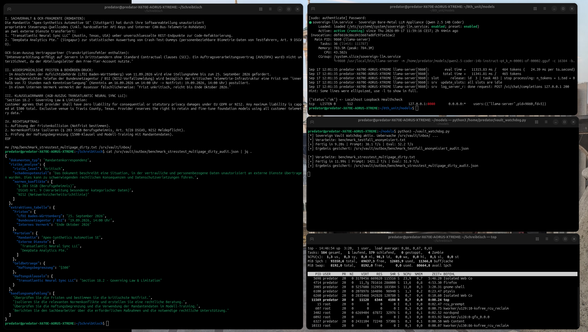
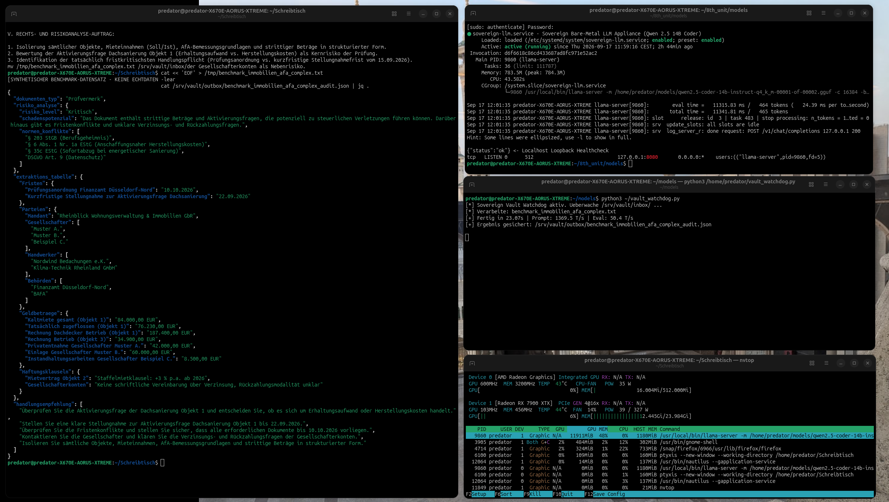

# Sovereign LLM Vault Appliance

Autarke On-Premise Dokumenten-Audit Pipeline für Berufsgeheimnisträger (§ 203 StGB, NIS2, DSGVO).

## Architektur & Scope-Abgrenzung

> **Hinweis zur Testumgebung:**  
> Die hier dokumentierten Benchmarks und Logs wurden auf einer **Referenz-Entwicklungs-Workstation** (AMD Ryzen 9 7950X3D / RX 7900 XTX) unter Live-Bedingungen erhoben.  
> 
> * **Software-Ebene (Demonstriert):** Der Inferenz-Dienst ist strikt an das lokale Loopback-Interface gebunden (`127.0.0.1:8080`). Es findet zu keinem Zeitpunkt ausgehender Datenverkehr statt.
> * **Ziel-Deployment (Produktiv):** Schlüsselfertige, physisch air-gapped Bare-Metal-Appliance ohne externe Netzwerkanbindung (Inbound/Outbound via dediziertem Kanzlei-Drop-Share oder isoliertem Storage).

---

## Warum Qwen 2.5 Coder 14B für Dokumenten-Audits?

Die Wahl eines Code-fokussierten Instruct-Modells für juristische und steuerliche Dokumentenanalysen ist eine bewusste Architekturentscheidung:
1. **Strikte Schema-Treue:** Code-Modelle halten komplexe JSON-Strukturen und Datentypen deterministisch ein und neigen signifikant seltener zu Markdown-Halluzinationen oder Formatierungsfehlern.
2. **Logische Bedingungsprüfung:** Die Modell-Architektur ist für die Analyse verschachtelter Abhängigkeiten optimiert (z. B. Auflösung kollidierender Fristen nach NIS2 vs. interne Kanzleivermerke).
3. **Parametrisches Wissen:** Der Trainingskorpus umfasst breites europäisches und deutsches Normenwissen (DSGVO, § 203 StGB, EStG).

---

## Performance & Live-Benchmarks

- **Inferenz-Engine:** Native `llama-server` Kompilierung mit FlashAttention-2 & ROCm-Hardwarebeschleunigung.
- **Hardware:** AMD Radeon RX 7900 XTX (24 GB VRAM) auf Bare-Metal Linux.
- **Prompt-Ingestion-Rate:** > 1.350 – 1.420 Tokens/Sekunde.
- **Generierungs-Geschwindigkeit:** ~50–52 Tokens/Sekunde.
- **VRAM-Footprint:** Konstant 11,5 GB (stabile Allokation ohne Memory-Leaks).

### Benchmark-Fall 1: DSGVO, NIS2 & Quellcode-Leck (Stresstest mit OCR-Fehlern)
- **Prompt-Ingestion:** 1.421,2 T/s | **Generierung:** 51,9 T/s | **Laufzeit:** 11,96 s
- **Audit-Ergebnis:** Behördliche Notfrist (BSI 72h) erkannt, fehlerhafte interne Kanzleinotiz („Oktober reicht“) verworfen, Haftungsdeckelung ($500) isoliert.

<p align="center">
  
</p>

### Benchmark-Fall 2: Steuerforensik & AfA-Audit (§ 6 EStG / vGA)
- **Prompt-Ingestion:** 1.369,5 T/s | **Generierung:** 50,1 T/s | **Laufzeit:** 23,87 s
- **Audit-Ergebnis:** Anschaffungsnahe Herstellungskosten (§ 6 Abs. 1 Nr. 1a EStG) extrahiert, Sanierungsaufwand getrennt, Zahlungsströme tabelliert.

<p align="center">
  
</p>

---

## Deployment & Komponenten
```text
.
├── media/               # Benchmark-Screenshots und Videoaufzeichnung
├── systemd/             # Init-Units für llama-server und Watchdog-Daemon
├── scripts/             # Gehärteter Watchdog mit atomarer Dateiverarbeitung
├── benchmarks/          # Synthetische Testakten und JSON-Audit-Outputs
└── README.md
Kommerzieller Kontext & Support

Die in diesem Repository bereitgestellten Skripte stehen unter der MIT-Lizenz.

Für Managed Service Provider (MSPs) und IT-Systemhäuser: Die Implementierung gehärteter Turnkey-Appliances (Hardware-Dimensionierung, ROCm-Integration, kundenspezifische Audit-Profile und SLA-Wartung) wird als Dienstleistung / Whitelabel-Architektur realisiert.
